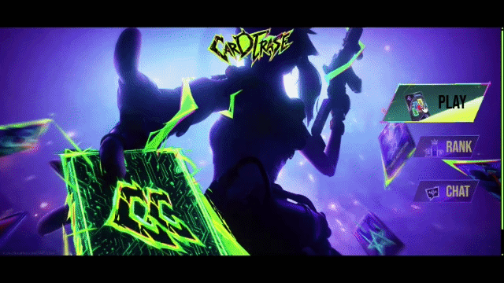
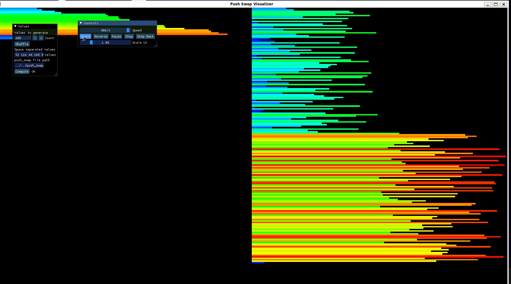

<h1 align="center">Hi, I'm Anas Qabbal 👋</h1>
<h3 align="center">Software Engineer | Systems, Backend & Full-Stack</h3>

---

<!-- 

  

  

 -->

  

---

  

## 👨‍💻 About Me

I am a software engineer with a rigorous foundation forged at **1337 (42 Network)**. I specialize in bridging the gap between low-level systems architecture and modern web applications. 

My engineering philosophy is rooted in building from the ground up. Whether it's developing a custom HTTP server in C++98, engineering a UNIX shell from scratch, or designing responsive full-stack applications, I am driven by a deep curiosity for how things work under the hood. I thrive in environments that demand robust problem-solving, clean code architecture, and continuous learning.

## 🛠️ Technical Skills

**Systems & Backend** 

**Full-Stack Web** 

## 🏗️ Engineering Capabilities

Through extensive project work, I have cultivated deep expertise in:
- **Low-Level Architecture:** Memory management, process creation (`fork`, `execve`), file descriptors, and robust signal handling.
- **Network Programming:** Designing non-blocking, multiplexed I/O architectures (`select`/`poll`) and implementing network protocols (HTTP/1.1) from raw sockets.
- **Concurrency:** Managing multithreaded environments, handling thread synchronization, and utilizing mutexes to prevent data races and deadlocks.
- **Algorithm Optimization:** Analyzing time/space complexity and designing highly optimized sorting and data manipulation algorithms under strict operational constraints.
- **Full-Stack & Real-Time Systems:** Designing interactive, data-driven web interfaces and utilizing WebSockets for low-latency, bi-directional multiplayer game states.
- **Security & Infrastructure:** Implementing Web Application Firewalls (WAF) and secret management systems (Vault) to secure distributed web services, alongside designing containerized ecosystems with in-memory caching (Redis) for database optimization.
- **Agile Collaboration & Peer Review:** Thriving in an intensive peer-to-peer learning ecosystem, I consistently drive collaborative problem-solving, conduct rigorous code reviews, and excel in team dynamics to deliver high-quality software.

## 🏆 Featured Core Projects

### 🦠 Conway's Game of Life
A containerized, full-stack implementation of Conway's Game of Life simulation, designed as a visual companion to demonstrate the process isolation, I/O piping, and routing concepts required by the 42 Network Exam06. It features an interactive React/TypeScript dashboard styled with Tailwind CSS, showing state transitions directly on cell click, and a Node.js/Express backend wrapping a C++ game logic engine compiled from OCF-compliant OOP code. The application uses container-based network isolation via Docker Compose, utilizing Vite's dev server proxy to route frontend calls to the isolated backend.

* **Technologies Used:** C++, TypeScript, React, Node.js, Express, Tailwind CSS, Docker, Vite.

🔗 [Discover more](https://github.com/WebProjects/GameOfLife)

---

### 🃏 ft_transcendence
The capstone full-stack project of the 42 curriculum. A real-time multiplayer gaming platform featuring three games — **UNO**, **Tic-Tac-Toe**, and **Liar's Bar** — powered by WebSockets (Socket.IO) across a microservices architecture with 5 independent backend services communicating via RabbitMQ. My major technical contributions focused on building the **Liar's Bar** bluffing card game with real-time multiplayer, implementing enterprise-grade security layers including a **ModSecurity WAF** (with OWASP rules) as the external traffic entry point and **HashiCorp Vault** for centralized secret management (JWT keys, SSL certificates, service credentials), and contributing to game customization options. The platform is fully containerized with Docker Compose, secured with HTTPS via self-signed SSL/TLS, and monitored through an ELK stack and Prometheus + Grafana.

* **Technologies Used:** Next.js, TypeScript, Express.js, Socket.IO, SQLite, RabbitMQ, Docker, Nginx, ModSecurity, HashiCorp Vault, ELK Stack, Prometheus, Grafana.

🔗 [Discover more](https://github.com/Anasqabbal/ft_transcendence)

---

### 🌐 Webserver (webserv)
A custom HTTP/1.1 server written in C++98. Engineered to handle GET, POST, and DELETE methods, support CGI, and manage multiple ports simultaneously using non-blocking I/O multiplexing. This project required a deep dive into network sockets and the RFCs governing the HTTP protocol.

🔗 [Discover more](https://github.com/anasqabbal/webserver)

---

### 🐚 Minishell
A functional UNIX shell developed from scratch in C. Features include a custom parser for user input, environment variable expansion, complex quote management, UNIX pipe handling, and the execution of built-ins and system binaries.

🔗 [Discover more](https://github.com/anasqabbal/minishell)

---

### 🎮 cub3D
A 3D graphics engine maze game built from scratch in C. Using Raycasting techniques (inspired by Wolfenstein 3D), the engine renders a pseudo-3D perspective from a 2D map grid in real-time. It features wall texturing, collision detection, and smooth player movement.

* **Technologies Used:** C, MiniLibX/MLX42, Raycasting (Trigonometry & DDA Algorithm).

🔗 [Discover more](https://github.com/anasqabbal/cub3D)

---

### 🐳 Inception
A containerized infrastructure project orchestrating services using Docker Compose. Built secure, custom images for NGINX, WordPress, and MariaDB on Alpine Linux, focusing on network security, volume persistence, and service isolation. Integrated Redis as an object caching layer to drastically reduce database load and optimize performance.

🔗 [Discover more](https://github.com/anasqabbal/Inception)

---

### ⚙️ Philosophers
A solution to the classic dining philosophers problem in C. This project demonstrates mastery over concurrent programming, utilizing `pthread` and `mutex` to safely manage shared resources without starvation or deadlocks.

🔗 [Discover more](https://github.com/anasqabbal/philosophers)

---

### 🔄 push_swap
An algorithmic optimization project designed to sort data on a stack using a highly constrained set of instructions. This project highlights my ability to implement and optimize complex sorting algorithms (e.g., using Longest Increasing Subsequence and chunking) and carefully manage memory in C.

​

🔗 [Discover more](https://github.com/Anasqabbal/push_swap)

### 🪶 some features to add

#### 💭 Game live chat
The In-Game Live Chat feature allows players to communicate with each other in real-time while actively engaged in gameplay. By providing a seamless, non-intrusive text interface, this feature fosters community, enables strategic coordination, and significantly enhances the multiplayer experience. Players can easily share tips, engage in friendly banter, and coordinate team tactics without ever having to pause the game or leave the current session.

#### add skins to the game
#### update the currents tiles
#### separate the code from the styles

